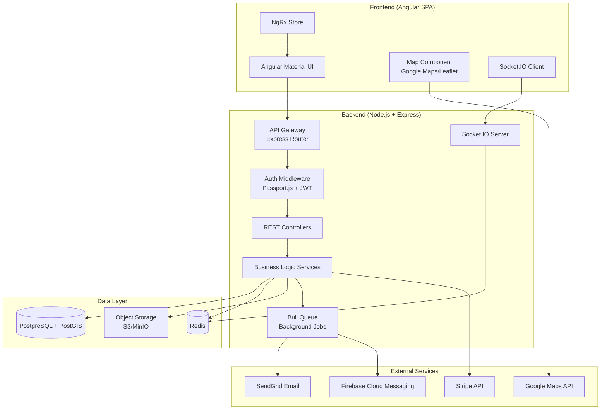
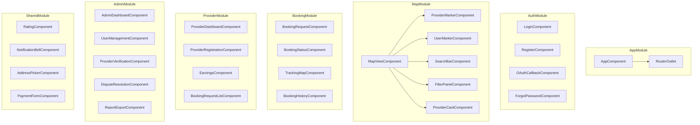
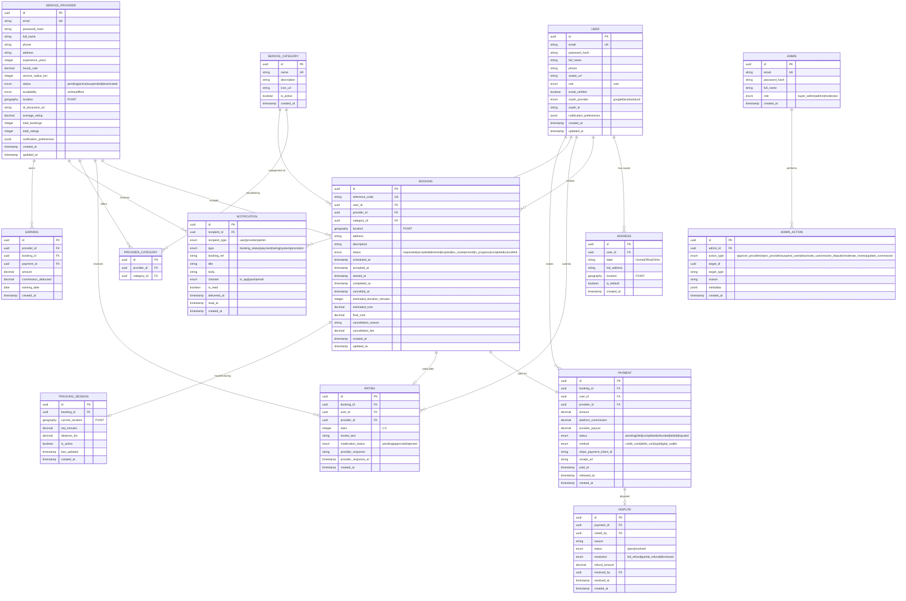

# Design Document: Home Services Marketplace

## Overview

The Home Services Marketplace is a full-stack web application that connects users with local service providers through an Uber-like, map-centric experience. The platform enables users to discover nearby professionals (electricians, plumbers, carpenters, etc.) on an interactive map, book services in real-time, track provider arrivals, process payments, and leave ratings.

### Technology Stack

| Layer | Technology | Purpose |
|-------|-----------|---------|
| Frontend | Angular 17+ with Angular Material | Responsive SPA with map-centric UI |
| Backend | Node.js 20+ with Express.js | REST API and WebSocket server |
| Database | PostgreSQL 16 with PostGIS | Relational data store with geospatial queries |
| Real-Time | Socket.IO | WebSocket-based real-time communication |
| Cache | Redis 7+ | Session management, caching, rate limiting |
| ORM | TypeORM | Database abstraction and migrations |
| Auth | Passport.js + JWT | OAuth and session-based authentication |
| Maps | Google Maps JavaScript API / Leaflet | Map rendering and geocoding |
| Payments | Stripe API | Tokenized payment processing and escrow |
| File Storage | AWS S3 / MinIO | Document uploads (ID proofs, profile photos) |
| Email | Nodemailer + SendGrid | Transactional email delivery |
| Push Notifications | Firebase Cloud Messaging (FCM) | Browser push notifications |

### Design Decisions

1. **Angular over React/Vue**: Chosen for its opinionated architecture with built-in dependency injection, strong typing with TypeScript, and Angular Material providing a consistent Uber-like design system out of the box.

2. **TypeORM over Sequelize**: TypeORM offers superior TypeScript integration, decorator-based entity definitions, and native PostGIS support via spatial column types.

3. **Socket.IO over raw WebSockets**: Provides automatic reconnection, room-based broadcasting (per-booking tracking rooms), and graceful fallback to polling.

4. **Redis for sessions and rate limiting**: In-memory store provides sub-millisecond access for session validation, geospatial caching of provider locations, and sliding-window rate limiting.

5. **PostGIS for geospatial**: Native spatial indexing (GiST) allows efficient radius-based queries for finding providers within 10-25 km, far outperforming application-level distance calculations.

6. **Stripe for payments**: PCI-DSS compliant tokenized processing eliminates the need to store raw card numbers. Built-in support for escrow via payment intents with delayed capture.

---

## Architecture

### High-Level Architecture Diagram



### Architecture Pattern

The system follows a **layered architecture** with clear separation of concerns:

1. **Presentation Layer (Angular)**: Handles UI rendering, user interactions, client-side state (NgRx), and real-time WebSocket communication.
2. **API Layer (Express Controllers)**: HTTP request handling, input validation, route definitions, and response formatting.
3. **Business Logic Layer (Services)**: Core domain logic including booking workflows, payment orchestration, search algorithms, and notification dispatch.
4. **Data Access Layer (TypeORM Repositories)**: Database queries, entity mappings, and spatial queries via PostGIS.
5. **Infrastructure Layer**: Redis caching, S3 file storage, external API integrations, and background job processing.

### Communication Patterns

- **REST API**: All CRUD operations and business workflows use RESTful endpoints over HTTPS.
- **WebSocket (Socket.IO)**: Real-time provider location tracking, booking status updates, and instant notifications.
- **Background Jobs (Bull Queue)**: Email sending, push notifications, payment settlement, and report generation run asynchronously via Redis-backed queues.

---

## Components and Interfaces

### Frontend Components (Angular)



### Backend API Modules

| Module | Endpoints | Responsibility |
|--------|-----------|----------------|
| `auth` | `/api/auth/*` | Registration, login, OAuth, password reset, email verification |
| `users` | `/api/users/*` | User profile CRUD, address management, preferences |
| `providers` | `/api/providers/*` | Provider registration, profile, availability toggle, dashboard |
| `search` | `/api/search/*` | Geospatial provider search, filtering, autocomplete |
| `bookings` | `/api/bookings/*` | Booking CRUD, status transitions, scheduling, cancellation |
| `tracking` | `/api/tracking/*` | Location updates (WebSocket), ETA calculation |
| `payments` | `/api/payments/*` | Payment intent creation, escrow, refunds, disputes |
| `ratings` | `/api/ratings/*` | Review submission, moderation, provider responses |
| `notifications` | `/api/notifications/*` | Notification preferences, history, delivery |
| `admin` | `/api/admin/*` | Dashboard metrics, user management, reports, moderation |

### Key Interfaces

#### Authentication Service Interface

```typescript
interface IAuthService {
  register(dto: RegisterUserDto): Promise<{ userId: string; verificationToken: string }>;
  login(dto: LoginDto): Promise<{ accessToken: string; refreshToken: string; expiresIn: number }>;
  loginOAuth(provider: 'google' | 'facebook', oauthToken: string): Promise<AuthTokens>;
  verifyEmail(token: string): Promise<void>;
  requestPasswordReset(email: string): Promise<void>;
  resetPassword(token: string, newPassword: string): Promise<void>;
  validateSession(token: string): Promise<UserSession | null>;
}
```

#### Search Service Interface

```typescript
interface ISearchService {
  findProviders(query: SearchProvidersDto): Promise<PaginatedResult<ProviderSummary>>;
  getProviderDetails(providerId: string): Promise<ProviderProfile>;
  geocodeAddress(address: string): Promise<GeoPoint>;
  reverseGeocode(point: GeoPoint): Promise<Address>;
  getAutocompleteSuggestions(partial: string): Promise<AddressSuggestion[]>;
}

interface SearchProvidersDto {
  location: GeoPoint;
  categoryId: string;
  radiusKm: number; // 1-25
  filters?: {
    minRating?: number; // 1-5
    priceRange?: { min: number; max: number };
    availableNow?: boolean;
  };
  sortBy?: 'distance' | 'rating' | 'price';
  limit?: number; // max 50
  offset?: number;
}

interface GeoPoint {
  latitude: number;  // -90 to 90
  longitude: number; // -180 to 180
}
```

#### Booking Service Interface

```typescript
interface IBookingService {
  createRequest(dto: CreateBookingDto): Promise<BookingRequest>;
  acceptBooking(bookingId: string, providerId: string): Promise<Booking>;
  declineBooking(bookingId: string, providerId: string, reason?: string): Promise<void>;
  cancelBooking(bookingId: string, userId: string): Promise<CancellationResult>;
  completeBooking(bookingId: string): Promise<Booking>;
  getAlternativeProviders(bookingId: string): Promise<ProviderSummary[]>;
  getBookingHistory(userId: string, pagination: PaginationDto): Promise<PaginatedResult<Booking>>;
}

interface CreateBookingDto {
  userId: string;
  providerId: string;
  categoryId: string;
  location: GeoPoint;
  address: string;
  description: string; // max 500 chars
  scheduledAt?: Date; // 2h to 7 days in future
  estimatedDuration: number; // in minutes
}
```

#### Tracking Service Interface (WebSocket)

```typescript
interface ITrackingService {
  startTracking(bookingId: string): void;
  updateProviderLocation(providerId: string, location: GeoPoint): void;
  getETA(bookingId: string): Promise<ETAResult>;
  stopTracking(bookingId: string): void;
}

// Socket.IO Events
interface TrackingEvents {
  // Server -> Client
  'provider:location': { bookingId: string; location: GeoPoint; timestamp: Date };
  'provider:eta': { bookingId: string; etaMinutes: number; distanceKm: number };
  'provider:arrived': { bookingId: string; timestamp: Date };
  'tracking:stale': { bookingId: string; lastKnownLocation: GeoPoint; lastUpdate: Date };

  // Client -> Server
  'location:update': { providerId: string; location: GeoPoint };
  'tracking:subscribe': { bookingId: string };
  'tracking:unsubscribe': { bookingId: string };
}
```

#### Payment Service Interface

```typescript
interface IPaymentService {
  createPaymentIntent(dto: CreatePaymentDto): Promise<PaymentIntent>;
  confirmPayment(paymentId: string): Promise<PaymentConfirmation>;
  holdInEscrow(paymentId: string): Promise<void>;
  releaseEscrow(paymentId: string): Promise<void>;
  processRefund(paymentId: string, amount?: number): Promise<Refund>;
  createDispute(paymentId: string, reason: string): Promise<Dispute>;
  getProviderEarnings(providerId: string, period: EarningsPeriod): Promise<EarningsBreakdown>;
}
```

#### Notification Service Interface

```typescript
interface INotificationService {
  send(dto: SendNotificationDto): Promise<void>;
  getHistory(userId: string, pagination: PaginationDto): Promise<PaginatedResult<Notification>>;
  updatePreferences(userId: string, prefs: NotificationPreferences): Promise<void>;
  getPreferences(userId: string): Promise<NotificationPreferences>;
}

interface SendNotificationDto {
  recipientId: string;
  type: NotificationType;
  bookingRef?: string;
  title: string;
  body: string;
  channels?: ('in_app' | 'push' | 'email')[];
}
```

---

## Data Models

### Entity Relationship Diagram



### Key PostgreSQL / PostGIS Details

```sql
-- Enable PostGIS extension
CREATE EXTENSION IF NOT EXISTS postgis;

-- Spatial index for provider location queries
CREATE INDEX idx_provider_location ON service_providers USING GIST (location);
CREATE INDEX idx_address_location ON addresses USING GIST (location);

-- Example geospatial query: find providers within 10km
SELECT sp.*,
  ST_Distance(sp.location::geography, ST_SetSRID(ST_MakePoint($1, $2), 4326)::geography) AS distance_meters
FROM service_providers sp
JOIN provider_categories pc ON pc.provider_id = sp.id
WHERE sp.status = 'active'
  AND sp.availability = 'online'
  AND pc.category_id = $3
  AND ST_DWithin(sp.location::geography, ST_SetSRID(ST_MakePoint($1, $2), 4326)::geography, $4)
ORDER BY distance_meters ASC
LIMIT 50;
```

### Redis Data Structures

| Key Pattern | Type | Purpose | TTL |
|-------------|------|---------|-----|
| `session:{userId}` | String (JWT) | Active user session | 24h |
| `provider:location:{providerId}` | Hash (lat, lng, timestamp) | Latest provider GPS | 60s |
| `rate_limit:{ip}:{endpoint}` | Sorted Set | Login attempt tracking | 15min |
| `booking:timeout:{bookingId}` | String | 2-min request expiry | 120s |
| `search:cache:{hash}` | String (JSON) | Cached search results | 30s |
| `notifications:unread:{userId}` | Counter | Unread notification badge | - |

---


## Correctness Properties

*A property is a characteristic or behavior that should hold true across all valid executions of a system — essentially, a formal statement about what the system should do. Properties serve as the bridge between human-readable specifications and machine-verifiable correctness guarantees.*

### Property 1: Invalid login credentials return generic error

*For any* combination of invalid login credentials (wrong email, wrong password, or both), the Auth_System should return an identical generic error message that does not reveal which field is incorrect.

**Validates: Requirements 1.3**

### Property 2: Expired session tokens are universally rejected

*For any* expired session token and any authenticated API endpoint, the Auth_System should reject the request and return an authentication error.

**Validates: Requirements 1.5**

### Property 3: Duplicate email registration is rejected

*For any* email address already associated with an existing account, attempting to register a new account with that email should be rejected with an appropriate error.

**Validates: Requirements 1.8**

### Property 4: Valid provider registration creates pending profile

*For any* valid provider registration DTO (with name, email, phone, address, 1-5 categories, experience 0-50 years, valid ID document, radius 1-50 km), the Profile_System should create a provider profile with status "pending."

**Validates: Requirements 2.1**

### Property 5: Document upload validation enforces format and size

*For any* file upload during provider registration, the system should accept only JPEG, PNG, or PDF files under 5 MB in size, and reject all others with a specific validation error.

**Validates: Requirements 2.5**

### Property 6: Provider search visibility matches availability status

*For any* active provider, they should appear in search results if and only if their availability status is "online." Providers with status "offline" should never appear in search results regardless of proximity.

**Validates: Requirements 2.6, 2.7**

### Property 7: Provider category count constraint

*For any* provider profile, the system should accept 1 to 5 service categories and reject attempts to set 0 or more than 5 categories.

**Validates: Requirements 2.8**

### Property 8: Provider registration validation rejects invalid data with specific errors

*For any* provider registration DTO with one or more invalid fields, the system should reject the submission and return specific validation error messages for each invalid field.

**Validates: Requirements 2.9**

### Property 9: Address save limit enforcement

*For any* user, the system should allow saving up to 5 addresses and reject any attempt to save a 6th address.

**Validates: Requirements 3.3**

### Property 10: Autocomplete requires minimum 3 characters

*For any* address input string shorter than 3 characters, the autocomplete should return no suggestions. For any string of 3 or more characters, the system should return suggestions.

**Validates: Requirements 3.6**

### Property 11: Geospatial search returns providers within radius, sorted by distance, capped at 50

*For any* user location, service category, and radius, the Search_Engine should return only providers within the specified radius, sorted by distance in ascending order, with a maximum of 50 results.

**Validates: Requirements 4.1, 4.4**

### Property 12: Search filters are conjunctive

*For any* set of providers and any combination of applied filters (minimum rating, price range, availability), every provider in the result set should satisfy ALL applied filter criteria simultaneously.

**Validates: Requirements 4.5**

### Property 13: Provider summary card contains all required fields

*For any* provider returned in search results, the summary card data should include provider name, rating (1-5 stars), distance in km, estimated arrival time in minutes, and hourly rate.

**Validates: Requirements 4.3**

### Property 14: Booking request contains required job details

*For any* valid booking request, the request sent to the provider should contain the service type, location, and preferred time.

**Validates: Requirements 5.1**

### Property 15: Alternative provider suggestions respect constraints

*For any* declined or expired booking, suggested alternative providers (up to 3) should be within the same service category, within the original search radius, and currently available.

**Validates: Requirements 5.4**

### Property 16: Booking description length constraint

*For any* booking request description, the system should accept descriptions of 0-500 characters and reject descriptions exceeding 500 characters.

**Validates: Requirements 5.5**

### Property 17: Cancellation fee determined by time until scheduled booking

*For any* booking cancellation, if the cancellation occurs more than 30 minutes before the scheduled time, no fee is applied. If it occurs 30 minutes or less before the scheduled time, a non-zero cancellation fee is applied.

**Validates: Requirements 5.6, 5.7**

### Property 18: Scheduling window validation

*For any* scheduled booking time, the system should accept times between 2 hours and 7 days in the future, and reject all other times.

**Validates: Requirements 5.8**

### Property 19: Booking time slot conflict detection

*For any* provider with an existing accepted booking for a time slot, new booking requests overlapping that time slot should be rejected and the provider excluded from available results for that time.

**Validates: Requirements 5.10**

### Property 20: Arrival notification triggers at 100-meter threshold

*For any* provider location update during active tracking, an arrival notification should be sent to the user if and only if the provider is within 100 meters of the user's location.

**Validates: Requirements 6.4**

### Property 21: ETA recalculation on location update

*For any* provider location update during active tracking, the ETA should be recalculated based on the new distance between provider and user location.

**Validates: Requirements 6.3**

### Property 22: Rating validation constraints

*For any* rating submission, the system should accept star values between 1 and 5 inclusive, review text of 0-1000 characters, and reject submissions more than 7 days after booking completion.

**Validates: Requirements 7.1**

### Property 23: Average rating calculation accuracy

*For any* set of ratings for a provider, the displayed average rating should equal the arithmetic mean of all star values, rounded to one decimal place.

**Validates: Requirements 7.2**

### Property 24: Provider review response constraint

*For any* provider response to a user review, the text should be accepted if it is 500 characters or fewer and rejected if it exceeds 500 characters. Only one response per review is allowed.

**Validates: Requirements 7.4**

### Property 25: Content moderation flags prohibited content

*For any* review text containing prohibited content (profanity, spam patterns, or personal information), the Rating_System should flag the review for moderation and withhold it from publication.

**Validates: Requirements 7.5**

### Property 26: Commission calculation correctness

*For any* payment amount and platform commission rate, the provider payout should equal the payment amount minus the commission, and all values (commission, payout) should be non-negative with commission + payout equaling the total amount.

**Validates: Requirements 8.6**

### Property 27: Price estimate calculation

*For any* hourly rate, estimated duration, and applicable service fees, the price estimate should equal (hourly_rate × estimated_duration_hours) + service_fees.

**Validates: Requirements 8.7**

### Property 28: Escrow release conditions

*For any* payment held in escrow, it should be released when the user confirms service completion OR when 48 hours have elapsed after booking completion, whichever occurs first.

**Validates: Requirements 8.3**

### Property 29: Notification dispatch on booking status change

*For any* booking status change, both the user and the service provider associated with the booking should receive a notification containing the new status and the timestamp of the change.

**Validates: Requirements 9.1**

### Property 30: Notification channel routing respects preferences

*For any* notification and any user preference configuration, the notification should be delivered only via explicitly enabled channels. When no preferences are configured, all supported channels should be used.

**Validates: Requirements 9.4**

### Property 31: Admin action reason minimum length

*For any* admin account suspension or deactivation action, the system should reject reasons shorter than 10 characters.

**Validates: Requirements 10.3**

### Property 32: Commission rate applies only to new bookings

*For any* commission rate change, bookings created after the change should use the new rate, while bookings created before the change should retain the original rate.

**Validates: Requirements 10.5**

### Property 33: Provider suspension cascades to pending bookings

*For any* provider account suspension or deactivation, all their pending and future bookings should be cancelled and affected users notified.

**Validates: Requirements 10.9**

### Property 34: Acceptance rate calculation

*For any* set of booking responses (accepted, declined, expired) within the past 30 days, the acceptance rate should equal accepted_count / (accepted_count + declined_count + expired_count).

**Validates: Requirements 11.1**

### Property 35: Earnings aggregation consistency

*For any* provider's earnings data, the sum of daily breakdowns for a given period should equal the total earnings for that period.

**Validates: Requirements 11.2**

### Property 36: Pagination correctness

*For any* booking history query, each page should contain at most 50 records, and navigating through all pages should yield exactly the total number of matching bookings.

**Validates: Requirements 11.3**

### Property 37: Password hashing uniqueness

*For any* two identical passwords hashed separately, the resulting hashes should be different (due to unique salt per account). For any password, verifying against its own hash should succeed.

**Validates: Requirements 13.3**

### Property 38: Password validation rules

*For any* password string, the system should accept it if and only if it is 8-128 characters long and contains at least one uppercase letter, one lowercase letter, one digit, and one special character from the set !@#$%^&*()-_+=.

**Validates: Requirements 13.4**

### Property 39: Rate limiting enforcement

*For any* IP address, the system should allow up to 5 failed login attempts within a 15-minute window and block subsequent attempts. After blocking, the IP should remain blocked for 30 minutes.

**Validates: Requirements 13.6, 13.7**

---

## Error Handling

### Error Handling Strategy

The system uses a layered error handling approach:

#### Backend Error Categories

| Category | HTTP Status | Handling |
|----------|-------------|----------|
| Validation Error | 400 | Return field-specific error messages |
| Authentication Error | 401 | Generic message, no field disclosure |
| Authorization Error | 403 | Access denied message |
| Not Found | 404 | Resource not found message |
| Conflict | 409 | Resource conflict (duplicate email, time slot) |
| Rate Limited | 429 | Retry-after header with block duration |
| Payment Error | 402 | Payment-specific failure reason |
| Server Error | 500 | Generic error, log details internally |
| Service Unavailable | 503 | Dependency failure (maps, payment, etc.) |

#### Error Response Format

```typescript
interface ApiError {
  status: number;
  code: string; // machine-readable error code
  message: string; // user-friendly message
  details?: Record<string, string>; // field-specific validation errors
  retryable: boolean;
  retryAfter?: number; // seconds until retry is allowed
}
```

#### Frontend Error Handling

- **HTTP Interceptor**: Angular HTTP interceptor catches all API errors centrally
- **Toast Notifications**: Non-blocking errors displayed via Angular Material snackbar
- **Dialog Prompts**: Critical errors (payment failure, booking conflict) shown in modal dialogs
- **Retry Logic**: Automatic retry with exponential backoff for 5xx errors (max 3 retries)
- **Offline Detection**: Service worker detects offline state, queues actions for retry
- **Graceful Degradation**: Map failures fall back to list view; WebSocket failures fall back to polling

#### WebSocket Error Handling

- **Reconnection**: Socket.IO automatic reconnection with exponential backoff (1s, 2s, 4s, 8s, max 30s)
- **Stale Data Indicator**: If no location update received for 60s, show last known position with stale badge
- **Room Cleanup**: Tracking rooms automatically destroyed when booking completes or is cancelled
- **Heartbeat**: Client sends heartbeat every 30s; server closes connection after 90s without heartbeat

#### Payment Error Handling

- **Idempotency Keys**: All payment operations use idempotency keys to prevent double-charging
- **Escrow Safety**: Payments held in escrow; released only on explicit confirmation or 48h timeout
- **Retry Mechanism**: Up to 3 payment retries with user confirmation before each retry
- **Dispute Flow**: Unresolved payment issues escalated to admin with 48h SLA

#### Background Job Error Handling

- **Dead Letter Queue**: Failed jobs moved to DLQ after 3 retries
- **Exponential Backoff**: Job retries at 1min, 5min, 15min intervals
- **Alerting**: DLQ depth > 100 triggers admin notification
- **Notification Fallback**: If primary channel fails 3 times, attempt delivery via next configured channel

---

## Testing Strategy

### Testing Approach

The testing strategy employs a dual approach:

1. **Property-Based Tests**: Verify universal correctness properties across randomly generated inputs (minimum 100 iterations per property)
2. **Unit Tests**: Cover specific examples, edge cases, and integration points
3. **Integration Tests**: Verify external service interactions and end-to-end workflows
4. **E2E Tests**: Browser-based tests for critical user journeys

### Technology Choices

| Test Type | Tool | Purpose |
|-----------|------|---------|
| Property-Based | fast-check (TypeScript) | Universal property verification with random input generation |
| Unit Tests | Jest | Backend service and utility testing |
| Angular Unit | Jasmine + Karma | Component and service testing |
| Integration | Jest + Supertest | API endpoint testing |
| E2E | Cypress | Browser-based user journey testing |
| Load | k6 | Performance and latency validation |

### Property-Based Testing Configuration

- **Library**: [fast-check](https://github.com/dubzzz/fast-check) for TypeScript/Node.js
- **Minimum iterations**: 100 per property test
- **Tag format**: `Feature: home-services-marketplace, Property {number}: {property_text}`
- Each property test directly maps to a correctness property in this design document
- Generators create realistic domain objects (GeoPoints, BookingDTOs, ProviderProfiles, etc.)

### Test Categories by Requirement Area

#### Authentication & Security (Properties 1-3, 37-39)
- Property tests for password validation, credential error responses, session expiry, rate limiting
- Unit tests for token generation, OAuth flow mocking
- Integration tests for full auth flow with database

#### Provider Management (Properties 4-8)
- Property tests for registration validation, file upload validation, category constraints
- Unit tests for profile CRUD operations
- Integration tests for admin approval workflow

#### Location & Search (Properties 9-13)
- Property tests for geospatial search correctness, filter logic, autocomplete threshold, address limits
- Unit tests for PostGIS query construction
- Integration tests for geocoding API interaction

#### Booking & Scheduling (Properties 14-19)
- Property tests for cancellation fee logic, scheduling window, conflict detection, description limits
- Unit tests for state machine transitions
- Integration tests for booking lifecycle with notifications

#### Real-Time Tracking (Properties 20-21)
- Property tests for distance threshold calculations, ETA recalculation
- Unit tests for location update processing
- Integration tests for Socket.IO event flow

#### Ratings & Reviews (Properties 22-25)
- Property tests for rating validation, average calculation, content moderation, response limits
- Unit tests for moderation rule engine
- Integration tests for full review lifecycle

#### Payments & Earnings (Properties 26-28, 34-36)
- Property tests for commission splits, price estimates, escrow release, earnings aggregation
- Unit tests for payment state machine
- Integration tests for Stripe API mocking

#### Notifications (Properties 29-30)
- Property tests for notification dispatch rules, channel routing
- Unit tests for preference merging logic
- Integration tests for delivery channel adapters

#### Admin & Platform (Properties 31-33)
- Property tests for action reason validation, commission rate scoping, cascade cancellation
- Unit tests for report generation
- Integration tests for admin dashboard metrics queries

### Test Pyramid Distribution

```
         /  E2E Tests  \          ~5% - Critical user journeys
        / Integration    \        ~20% - API and service integration
       / Unit + Property   \      ~75% - Business logic and properties
      /____________________\
```

### Key Testing Principles

- Property tests run with `fast-check`'s default shrinking to find minimal failing examples
- All property tests tagged with design document reference for traceability
- Unit tests focus on edge cases and specific scenarios that complement property tests
- Integration tests use Docker-based PostgreSQL + Redis for realistic environment
- E2E tests cover: registration → search → booking → tracking → payment → rating flow
- CI pipeline runs property tests with 100 iterations; nightly runs use 1000 iterations
